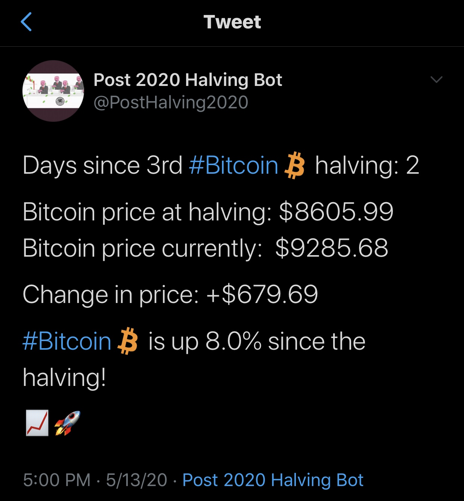

## Bitcoin Halving Twitter Bot

This tweeting bot tweets the price of bitcoin compared to it's price right before the 3rd halving
on May 11th, 2020.

This bot uses the CoinMarketCap (CMC) API to retrieve the current BTC price
This bot gains it's functionality due to the Twitter API, which can be done by applying for a twitter developers account

Bot tweets once a day, typically at 5pm central time. (**This is subject to change**)

Tweet Example:

## Important Note

APIs (Application Programming Interfaces) are a structured way for programs to communicate with other programs. A knowledge of APIs allows your programs to communicate with major services such as The New York Times and Twitter and collect data from organizations such as the Library of Congress. 

Do not share your API key, secret, or access tokens with anyone, and do not publish code with your key or token visible. Treat your keys and tokens as you would a password.

## About

Creator: Mohammed Patel
--
2nd Year Computer Science & Software Engineering Student at Loyola University Chicago
Lead Website Developer for Blockchain@LUC
--

